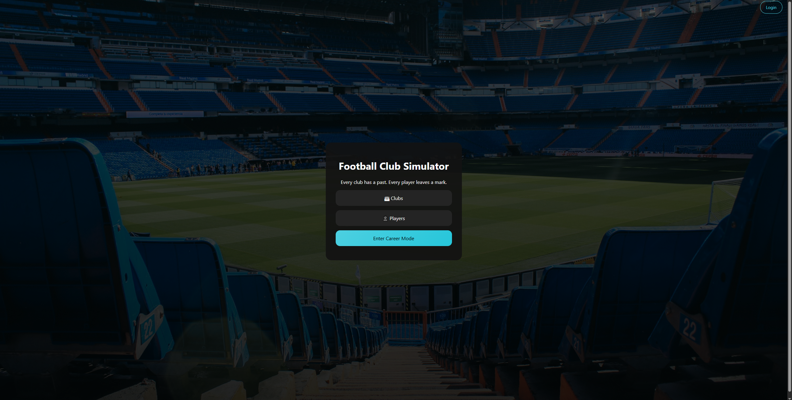
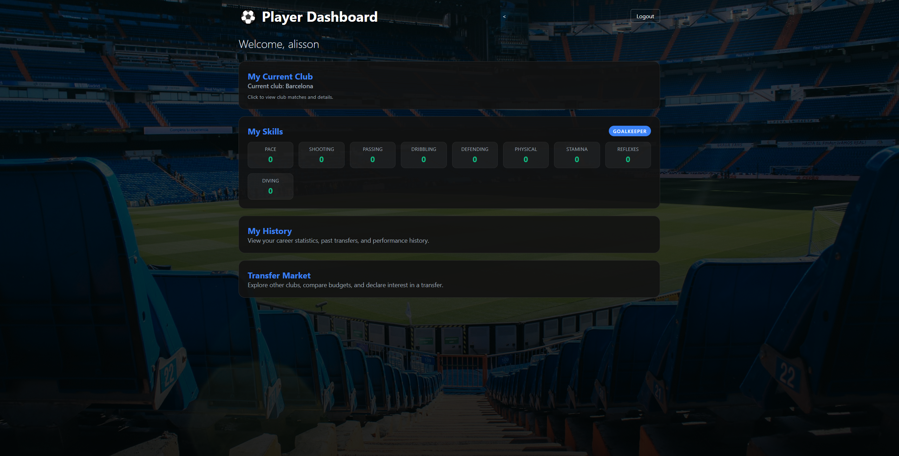
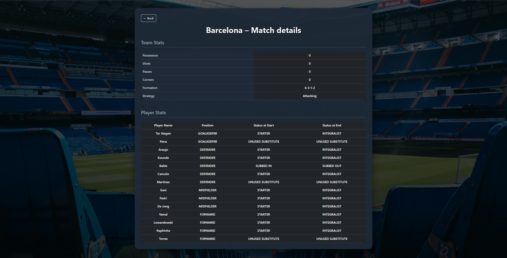
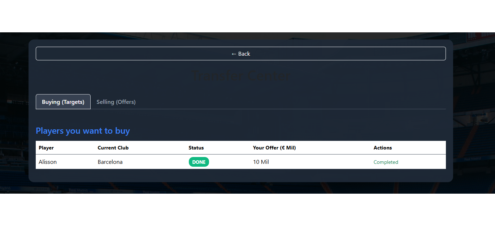
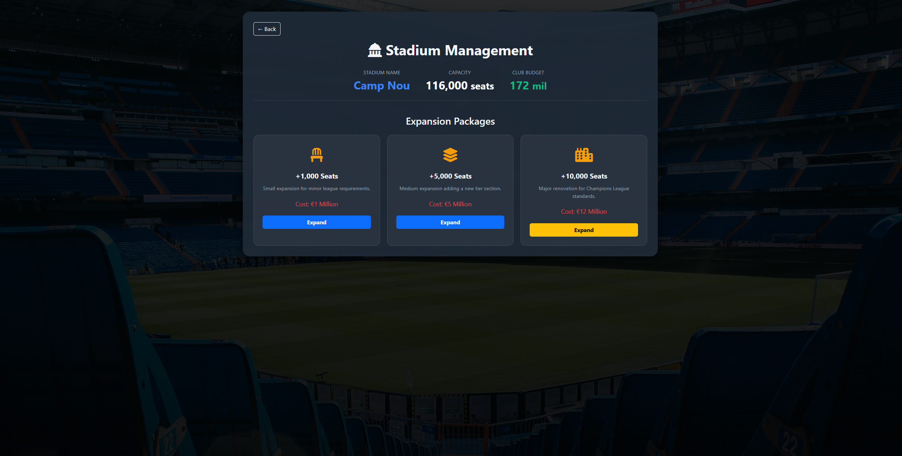

# ⚽ Football Club Simulator

Welcome to the **Football Club Simulator**, a comprehensive client-server web application built to manage and simulate the complex ecosystem of a professional football club. 

Developed as a Software Engineering project, this application features a RESTful Spring Boot backend and an HTML/CSS/JavaScript frontend. It provides a deeply interactive career mode where different actors (Players, Coaches, Managers, and Admins) experience the football world through their unique responsibilities and permissions.

## 📖 Project Overview

The simulator models the real-world interactions within a football club. It goes beyond simple CRUD operations by implementing complex business logic—such as a multi-layered transfer system, real-time match statistics, and financial management. Data persistence is robustly handled via a MySQL relational database with schema versioning managed by Flyway.

## ✨ Features by Role

The application uses a strict role-based access control system to define what each user can do:

### 🏃‍♂️ Player
**Dashboard & Attributes:** View personal skills (Pace, Shooting, Passing, etc.) and current club details.
**Career History:** Track past transfers, match appearances, and performance statistics across different seasons.
**Transfer Market:** Explore other clubs, compare budgets, and explicitly declare interest in a transfer to initiate the negotiation process.

### 👔 Coach
**Tactical Management:** Set the team's formation (e.g., 4-3-3) and overall play style/strategy (e.g., Balanced, Attacking).
**Squad Selection:** Choose the Starting XI and designate substitutes before the next match.
**Match Day:** Make tactical changes and substitutions during live matches and view detailed match status/statistics.

### 💼 Manager
**Financial Control:** Manage the club's budget and modify player/coach salaries.
**Complex Transfers:** Participate in a realistic transfer market. Managers can propose transfer sums for targeted players, receive offers, and ultimately approve or reject deals. 
**Infrastructure:** Plan and fund stadium expansions (e.g., adding 1,000, 5,000, or 10,000 seats based on the club's budget).

### 🛠️ Admin & 👤 Guest
**Admin:** Full access to manage user accounts (create, delete, modify) and system maintenance.
**Guest (Unsigned):** Can browse the platform to view public club information and rosters without needing an account.

## 📸 Screenshots

Here is a glimpse into the Football Club Simulator interface:

*Above: The landing page where users can explore clubs or enter Career Mode.*

*Above: The Player Dashboard showing skill attributes and career history options.*

*Above: Match Details.*

*Above: Overview of the transfers.*

*Above: Stadium expansion packages available to the Club Manager.*

*Above: Transfers from the player's side.*

## 💻 Tech Stack & Architecture

**Backend:** Java Spring Boot (Spring Web, Spring Data JPA).
**Frontend:** HTML/CSS/JavaScript (Fetch API for REST communication).
**Database:** MySQL.
**Database Migrations:** Flyway (automatically handles schema creation and updates on startup).
**Architecture:** Layered REST API (Controllers -> Services -> Repositories -> Domain Entities) ensuring high cohesion and loose coupling.

## 🚀 Getting Started

### Prerequisites
* Java JDK installed
* MySQL Server (running locally or via Docker)
* Maven

## 👨‍💻 Authors

CaesarHD

Adelin77

